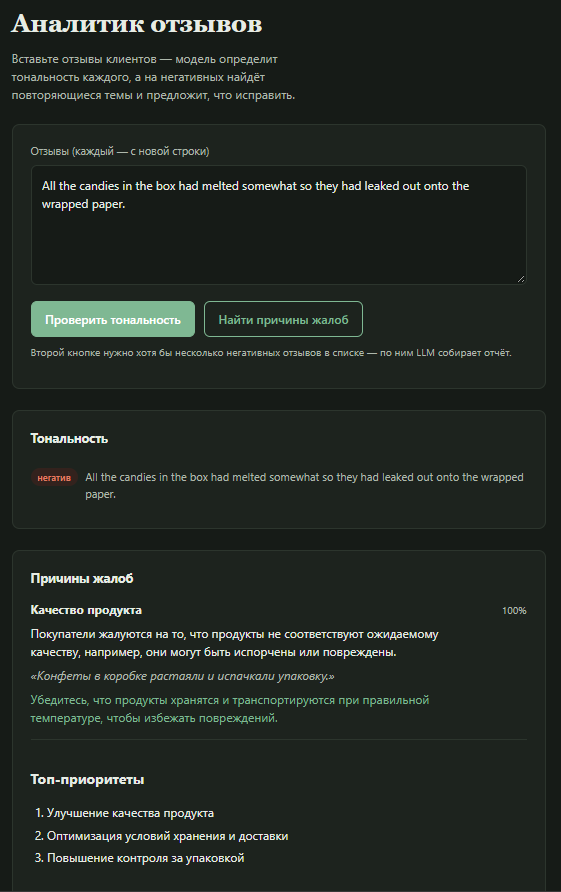

# 📊 Аналитик отзывов для бизнеса

Гибридный ML + AI проект: классификация тональности отзывов клиентов и
автоматическая генерация бизнес-рекомендаций на основе жалоб. Весь путь —
от данных до задеплоенного в облаке сервиса — проходит в одном Colab-ноутбуке.

**Датасет:** [Amazon Fine Food Reviews](https://www.kaggle.com/datasets/snap/amazon-fine-food-reviews) (Kaggle)

[](https://colab.research.google.com/github/Qiwer01/review_analyzer/blob/main/review_analyzer_colab.ipynb)

🔗 **Живой демо-сервис:** `http://3.25.99.0:8000` _(поднят на AWS EC2; если недоступен — см. раздел «Запуск» ниже, чтобы поднять свою копию)_



---

## Идея проекта

Бизнес получает сотни/тысячи отзывов и физически не может прочитать каждый.
Сервис:

1. **ML-часть** — классифицирует каждый отзыв (`negative` / `neutral` / `positive`)
   моделью TF-IDF + LinearSVC
2. **AI-часть** — берёт отзывы, помеченные как негативные, отправляет в LLM
   (OpenAI `gpt-4o-mini`), которая группирует их по темам жалоб и предлагает
   конкретные улучшения
3. **Продукт** — FastAPI-сервис с простым веб-интерфейсом: вставляешь отзывы →
   получаешь тональность + AI-отчёт для менеджмента

```
Отзывы (текст)
      │
      ▼
┌─────────────┐      негативные      ┌──────────────┐
│  ML: TF-IDF │  ──────отзывы──────▶ │  LLM-анализ  │
│  + LinearSVC│                      │ (темы жалоб, │
│             │                      │ рекомендации)│
└─────────────┘                      └──────────────┘
      │                                      │
      ▼                                      ▼
 тональность                          структурированный
 каждого отзыва                       отчёт для бизнеса
```

---

## Что внутри ноутбука

`review_analyzer_colab.ipynb` — единственный источник правды для всего проекта:

| Блок               | Что делает                                                                                |
| ------------------ | ----------------------------------------------------------------------------------------- |
| 1. Данные          | Скачивает `Reviews.csv` через Kaggle API — не нужно хранить датасет в репозитории         |
| 2. Модель-артефакт | Очистка текста, TF-IDF + LinearSVC, метрики, сохранение `model.pkl`                       |
| 3. API-ключ        | Подключение `OPENAI_API_KEY` через Colab Secrets (без хардкода в коде)                    |
| 4. FastAPI         | Генерирует `main.py`, `llm_analyzer.py`, `index.html`                                     |
| 5. Запуск + тесты  | Поднимает сервер внутри Colab, проверяет `/health`, `/predict-batch`, `/analyze-negative` |
| 6. Просмотр        | Интерфейс и Swagger-документация прямо в выводе ячеек                                     |
| 7. Docker          | Генерирует `Dockerfile` для деплоя на реальный сервер (AWS EC2)                           |

## Структура репозитория

```
review-analyzer/
├── review_analyzer_colab.ipynb   # Весь пайплайн: данные → модель → API → Docker
├── review-api/                    # Снэпшот файлов, которые генерирует ноутбук
│   ├── main.py                    # FastAPI: /predict, /predict-batch, /analyze-negative
│   ├── llm_analyzer.py            # Промпт + вызов LLM + парсинг ответа
│   ├── index.html                 # Интерфейс для обычного пользователя
│   ├── requirements.txt           # Версии зафиксированы под обученную модель
│   ├── Dockerfile
│   └── .dockerignore
├── screenshots/
│   └── demo.png
├── .gitignore
└── README.md
```

`model.pkl` в репозиторий не коммитится — ноутбук пересобирает его за
5–10 минут при каждом запуске. Если нужна копия без повторного обучения —
экспортируйте `review-api/model.pkl` из Colab (Файлы → скачать) и добавьте
в `review-api/` перед `docker build`.

---

## Как запустить

### Вариант А — интерактивно, в Colab (для изучения/переобучения)

1. Откройте `review_analyzer_colab.ipynb` по значку **Open in Colab** выше
2. Заведите три секрета через панель 🔑 слева: `OPENAI_API_KEY`,
   `KAGGLE_USERNAME`, `KAGGLE_KEY` (как получить — см. комментарии в
   соответствующих ячейках ноутбука)
3. Выполняйте ячейки по порядку сверху вниз
4. В Блоке 6 интерфейс откроется прямо в выводе ячейки

### Вариант B — задеплоить готовый сервис (то, что стоит на AWS)

```bash
# на сервере, после scp/git clone папки review-api
cd review-api
docker build -t review-api .
docker run -d -p 8000:8000 --name review-api-container --restart always \
  -e OPENAI_API_KEY=ваш_ключ \
  review-api
```

Ключ передаётся флагом `-e` при запуске, а не хранится внутри образа —
единственный сервис в этом проекте, который на каждый запрос стучится
во внешний API, поэтому и единственный, кому нужен секрет во время работы.

---

## API

| Метод  | Путь                | Что делает                                                 |
| ------ | ------------------- | ---------------------------------------------------------- |
| `GET`  | `/`                 | Веб-интерфейс (`index.html`)                               |
| `GET`  | `/health`           | Проверка, что сервис жив                                   |
| `GET`  | `/info`             | Метаданные модели                                          |
| `POST` | `/predict`          | Тональность одного отзыва                                  |
| `POST` | `/predict-batch`    | Тональность списка отзывов                                 |
| `POST` | `/analyze-negative` | ML отбирает негативные → LLM собирает отчёт по темам жалоб |

Полная интерактивная документация — `/docs` (Swagger, генерируется FastAPI автоматически).

---

## Метрики модели

| Модель             | Accuracy | Macro F1 |
| ------------------ | -------- | -------- |
| TF-IDF + LinearSVC | 0.860    | 0.685    |

## Стек

`scikit-learn` · `pandas` · `FastAPI` · `uvicorn` · `OpenAI API` (`gpt-4o-mini`) · `Docker` · `AWS EC2`

## Известные ограничения

- Модель не учитывает контекст и сарказм — типичное ограничение TF-IDF-подходов
- Класс `neutral` слабо выражен в данных — модель хуже всего работает именно на нём
- LLM-промпт заточен под отзывы о еде; для другого домена формулировки в `llm_analyzer.py` стоит адаптировать
- Публичный `/analyze-negative` расходует токены OpenAI на каждый запрос — при деплое стоит ограничить доступ (например, простым секретным заголовком) и выставить лимит расходов в биллинге OpenAI
